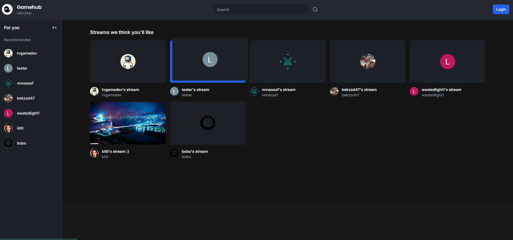
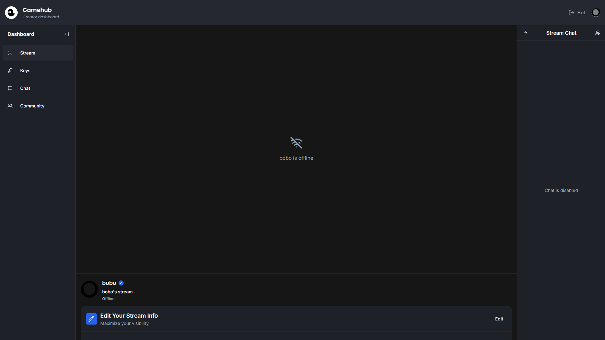

# Next.js Twitch‑Style Livestreaming Starter

[](https://nextjs.org/) [](https://www.typescriptlang.org/) [](https://tailwindcss.com/) [](https://clerk.com/) [](https://prisma.io/) [](https://livekit.io/) [](https://uploadthing.com/)

A minimal, modern foundation for building a Twitch‑like livestreaming app with **Next.js App Router + TypeScript**, **Clerk** for auth, **Prisma** for data, **LiveKit** for real‑time video, **UploadThing** for file uploads, and **Tailwind CSS** for styling.

---

## Problem statement

Building a production‑feel livestreaming platform requires stitching together many moving parts—authentication, real‑time video, channel metadata, thumbnails, role‑based access, and a database that plays nicely with server components. Most examples focus on one piece at a time, which makes it hard to see **how the whole stack fits together**.

> This repository provides a **clean, end‑to‑end starting point** showing how to combine these tools into a cohesive app: creators sign in, configure a stream, go live via LiveKit, and viewers open a channel page to watch.

---

## Live demo

- Preview: **[https://nextjs-twitch-clone-one.vercel.app](https://nextjs-twitch-clone-one.vercel.app)**

> Note: This is a developer preview. Some actions (e.g. starting a stream) depend on your environment keys/roles.

---

## Feature matrix

| Area      | Creator                              | Viewer                                                |
| --------- | ------------------------------------ | ----------------------------------------------------- |
| Auth      | Clerk sign‑in/sign‑up                | Anonymous/Authed viewing supported depending on route |
| Channels  | Create/update basic channel metadata | Browse/open a channel page                            |
| Streaming | Publish to LiveKit room/ingress      | Playback from LiveKit room                            |
| Assets    | UploadThing for thumbnails/avatars   | View rendered thumbnails                              |
| Data      | Prisma models & migrations           | –                                                     |
| UI        | Tailwind starter components          | Responsive channel/watch pages                        |

> Scope is intentionally lean so you can extend it (chat, moderation, follows, VODs, analytics, etc.).

---

## What’s inside

- **Next.js App Router** with Server Components & Server Actions
- **Clerk** authentication
- **Prisma** schema and migrations (DB via `DATABASE_URL`)
- **LiveKit** client integration for real‑time livestream publish/playback
- **UploadThing** for file uploads
- **Tailwind CSS** utility‑first styling
- Sensible project layout and linting

### Project structure

```text
app/          # Routes (App Router), layouts, pages, server actions
components/   # Reusable UI components
hooks/        # Custom React hooks
lib/          # Server utilities, clients, helpers
prisma/       # Prisma schema & migrations
public/       # Static assets (place screenshots here)
store/        # Client state (e.g., Zustand)
```

---

## Quickstart

### 1) Prerequisites

- **Node.js** ≥ 18
- An SQL database (SQLite/MySQL/Postgres via Prisma)
- **Clerk** app (auth)
- **LiveKit** (Cloud or self‑hosted) for WebRTC/ingress
- **UploadThing** account (uploads)

### 2) Clone & install

```bash
git clone https://github.com/zntb/nextjs-twitch-clone
cd nextjs-twitch-clone
npm install
# or pnpm i / yarn / bun i
```

### 3) Environment variables

Create `.env` (or `.env.local`) in the project root:

```dotenv
# Auth (Clerk)
NEXT_PUBLIC_CLERK_PUBLISHABLE_KEY=
CLERK_SECRET_KEY=

# Database (Prisma)
DATABASE_URL=

# LiveKit
NEXT_PUBLIC_LIVEKIT_WS_URL=
LIVEKIT_API_KEY=
LIVEKIT_API_SECRET=

# UploadThing
UPLOADTHING_TOKEN=
```

> **Tip:** Use SQLite locally (simple dev) and Postgres/MySQL in prod.

### 4) Prisma init

```bash
npx prisma generate
npx prisma db push
# optional: npx prisma studio
```

### 5) Run dev server

```bash
npm run dev
# open http://localhost:3000
```

---

## How the streaming flow works

1. **Creator auths** with Clerk → creator‑only screens are available.
2. **Go Live** sets up a **LiveKit** publish session/ingress; channel/stream state is persisted via **Prisma**.
3. **Viewer** opens a channel page and connects to the corresponding **LiveKit** room for playback.

Exact workflows will vary with your LiveKit deployment (rooms, ingress, keys). Start simple locally, then harden for prod.

---

## Scripts

Common scripts (see `package.json` for the full list):

- `dev` – start local development
- `build` – production build
- `start` – run the production server
- `lint` – lint the codebase

---

## Screenshots





---

## Roadmap ideas

- Channel pages (about, schedule, VOD placeholders)
- Real‑time chat + moderation
- Follows & notifications
- Creator dashboard (stream health, title/category, thumbnail management)
- Access controls (followers‑only chat, slow‑mode, block/ban)
- Analytics (concurrent viewers, watch time)

Contributions and issues are welcome!

---

## Troubleshooting

- **Prisma in Next.js dev**: Ensure a single Prisma client instance (e.g., `lib/db.ts`) and a valid `DATABASE_URL`.
- **LiveKit connectivity**: Verify `NEXT_PUBLIC_LIVEKIT_WS_URL` and that your Ingress/Room is reachable from clients (use a tunnel for local testing).
- **Clerk redirect URLs**: Add local & production URLs in Clerk (including `/sign-in` and `/sign-up`).

---

## License

This project is licensed under the MIT License. See the [LICENSE](./LICENSE) file for details.

---

## Acknowledgements

Thanks to the teams behind Next.js, Clerk, Prisma, LiveKit, UploadThing, and Tailwind CSS. If you ship something with this starter, consider sharing your learnings with the community.
